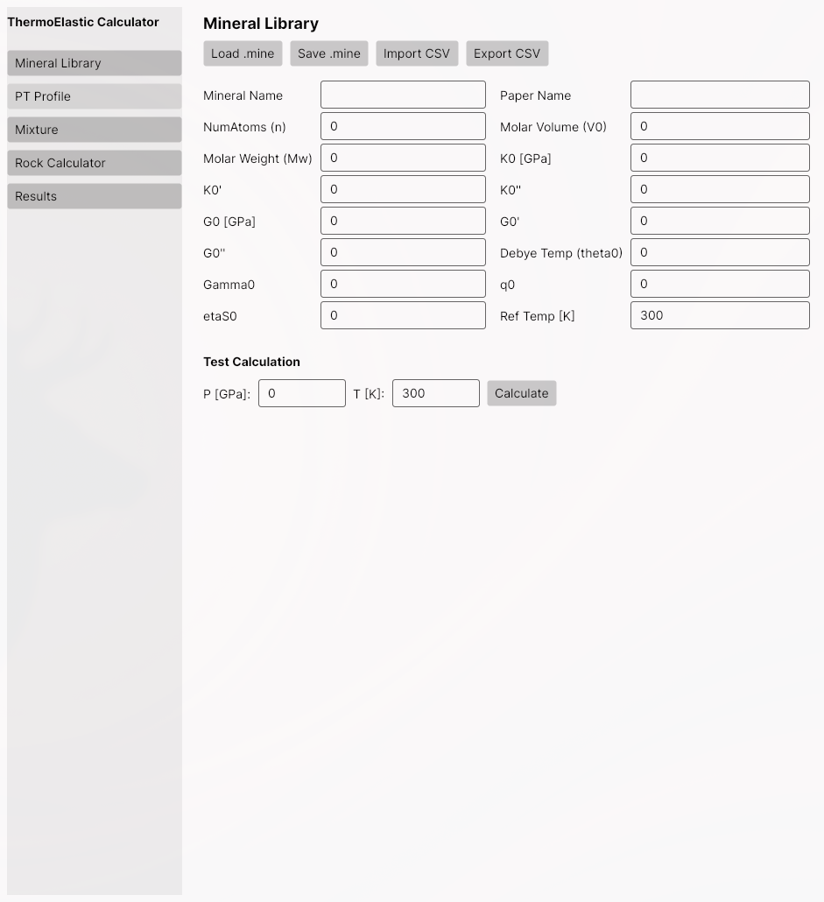

# ThermoElasticCalculator User Guide

## Overview

ThermoElasticCalculator is a cross-platform desktop application for computing thermoelastic properties of mantle minerals and rock compositions under arbitrary pressure-temperature (P-T) conditions. It implements the Stixrude & Lithgow-Bertelloni (2005, 2011) thermodynamic model using:

- **Birch-Murnaghan 3rd-order equation of state** for pressure-volume relationships
- **Mie-Gruneisen thermal model** for temperature effects
- **Debye model** for internal energy and heat capacity
- **Mixture theory** (Voigt, Reuss, Hill, Hashin-Shtrikman) for composite rock properties

Built with .NET 8 and Avalonia UI, the application runs on Windows, macOS, and Linux.

---

## Installation

### Prerequisites

- [.NET 8 SDK](https://dotnet.microsoft.com/download/dotnet/8.0)

### Build from Source

```bash
git clone <repository-url>
cd ThermoElasticCalculator
dotnet build ThermoElasticCalculator.sln --configuration Release
```

### Run

```bash
dotnet run --project src/ThermoElastic.Desktop
```

---

## Application Layout

The application uses a sidebar navigation design with five main views:



The left sidebar contains navigation buttons:

| Button | View | Description |
|--------|------|-------------|
| **Mineral Library** | Mineral parameter editor | Load, edit, and save mineral data |
| **PT Profile** | P-T profile calculator | Calculate properties along a P-T path |
| **Mixture** | 2-mineral mixture calculator | Compute properties for binary mineral mixtures |
| **Rock Calculator** | Multi-mineral rock calculator | Calculate composite rock properties |
| **Results** | Results viewer | View and export calculation results |

---

## Mineral Library

The Mineral Library view is the primary interface for managing mineral parameters. It allows you to load, edit, save, and test mineral data.

### Mineral Parameters

Each mineral is defined by the following parameters:

| Parameter | Symbol | Unit | Description |
|-----------|--------|------|-------------|
| Mineral Name | - | - | Full mineral name (e.g., "Forsterite") |
| Paper Name | - | - | Abbreviated name (e.g., "fo") |
| NumAtoms (n) | n | - | Number of atoms per formula unit |
| Molar Volume (V0) | V_0 | cm³/mol | Molar volume at reference conditions |
| Molar Weight (Mw) | M_w | g/mol | Molar weight |
| K0 | K_0 | GPa | Isothermal bulk modulus at reference state |
| K0' | K'_0 | - | First pressure derivative of K |
| K0'' | K''_0 | GPa⁻¹ | Second pressure derivative of K |
| G0 | G_0 | GPa | Shear modulus at reference state |
| G0' | G'_0 | - | First pressure derivative of G |
| G0'' | G''_0 | GPa⁻¹ | Second pressure derivative of G |
| Debye Temp (theta0) | θ_0 | K | Debye temperature at reference state |
| Gamma0 | γ_0 | - | Gruneisen parameter |
| q0 | q_0 | - | Logarithmic volume derivative of γ |
| etaS0 | η_S0 | - | Shear strain derivative of γ |
| Ref Temp | T_ref | K | Reference temperature (usually 300 K) |

### File Operations

- **Load .mine** - Load a mineral parameter file (JSON format)
- **Save .mine** - Save current parameters as a `.mine` file
- **Import CSV** - Import mineral data from a CSV file
- **Export CSV** - Export mineral data as CSV

### Test Calculation

Enter a pressure (GPa) and temperature (K), then click **Calculate** to verify mineral parameters by computing thermoelastic properties at those conditions.

---

## P-T Profile Calculator

This view computes mineral properties along a pressure-temperature profile (geotherm, adiabat, etc.).

### Workflow

1. Click **Load Mineral...** to select a `.mine` file
2. Either:
   - Click **Load PT Profile...** to load a `.ptpf` file, or
   - Click **Add P-T Point** to manually add pressure-temperature points in the left data grid
3. Click **Calculate** to compute properties at each P-T point
4. Results appear in the right data grid

### P-T Profile Format

P-T profiles are saved as `.ptpf` files (JSON) containing a list of pressure-temperature pairs:

```json
{
  "Name": "Mantle Geotherm",
  "Profile": [
    { "Pressure": 1.0, "Temperature": 500.0 },
    { "Pressure": 5.0, "Temperature": 1000.0 },
    { "Pressure": 10.0, "Temperature": 1500.0 }
  ]
}
```

### Output Properties

For each P-T point, the following properties are computed:

| Property | Symbol | Unit | Description |
|----------|--------|------|-------------|
| P | P | GPa | Pressure |
| T | T | K | Temperature |
| Vp | V_P | m/s | P-wave velocity |
| Vs | V_S | m/s | S-wave velocity |
| Vb | V_Φ | m/s | Bulk sound velocity |
| Density | ρ | g/cm³ | Density |
| Volume | V | cm³/mol | Molar volume |
| KS | K_S | GPa | Adiabatic bulk modulus |
| KT | K_T | GPa | Isothermal bulk modulus |
| GS | G | GPa | Shear modulus |
| Alpha | α | K⁻¹ | Thermal expansion coefficient |
| Debye Temp | θ | K | Debye temperature |
| Gamma | γ | - | Gruneisen parameter |
| etaS | η_S | - | Shear strain derivative |
| q | q | - | Volume derivative of γ |

### Export

Click **Export CSV...** to save results as a CSV file.

---

## Mixture Calculator

The Mixture Calculator computes thermoelastic properties for a binary (two-mineral) mixture as a function of composition (volume fraction).

### Workflow

1. Click **Load Mineral 1...** and **Load Mineral 2...** to select two minerals
2. Set the **Pressure** (GPa) and **Temperature** (K) conditions
3. Define the composition range:
   - Set **Ratio Start**, **Ratio End**, and **Ratio Step**
   - Click **Generate** to create the ratio list
   - The ratio represents the volume fraction of Mineral 1 (0.0 = pure Mineral 2, 1.0 = pure Mineral 1)
4. Select a mixture **Method** (Voigt, Reuss, Hill, or HS)
5. Click **Calculate**

### Mixture Methods

| Method | Description |
|--------|-------------|
| **Voigt** | Equal-strain (upper bound): M = Σ f_i · M_i |
| **Reuss** | Equal-stress (lower bound): 1/M = Σ f_i / M_i |
| **Hill** | Arithmetic mean of Voigt and Reuss |
| **HS** | Hashin-Shtrikman variational bounds |

### VProfile Save/Load

- **Save VProfile...** - Save the current mineral pair and ratio list as a `.vpf` file
- **Load VProfile...** - Restore a previously saved VProfile configuration

### Export

Click **Export CSV...** to export results.

---

## Rock Calculator

The Rock Calculator handles multi-mineral rock compositions with arbitrary numbers of mineral phases and volume fractions.

### Workflow

1. Enter a **Rock Name**
2. Click **Add Mineral...** repeatedly to add mineral phases (each loaded from a `.mine` file)
3. Edit the **Volume Ratio** column in the mineral list to set volume fractions (should sum to 1.0)
4. Set **Pressure** (GPa) and **Temperature** (K)
5. Select a mixture **Method**
6. Click **Calculate**

### Rock Composition Files

Rock compositions can be saved/loaded as `.rock` files (JSON):

- **Save Rock...** - Save the current mineral list and ratios
- **Load Rock...** - Load a previously defined rock composition

### Output

Results include:
- Individual mineral properties at the specified P-T conditions
- Mixed (composite) rock properties calculated using the selected averaging method

Click **Export CSV...** to save all results.

---

## Results View

The Results view provides a centralized location to view and export calculation results in a data grid format.

Click **Export CSV...** to export the displayed results.

---

## File Formats

| Extension | Description | Format |
|-----------|-------------|--------|
| `.mine` | Single mineral parameters | JSON |
| `.ptpf` | Pressure-temperature profile | JSON |
| `.vpf` | Volume profile (2-mineral mixture config) | JSON |
| `.rock` | Rock composition (N minerals + ratios) | JSON |
| `.csv` | Mineral data or calculation results | CSV |

All JSON files are human-readable and can be edited with a text editor.

---

## CSV Format

### Mineral CSV (Import/Export)

```
MineralName,PaperName,NumAtoms,MolarVolume,MolarWeight,KZero,K1Prime,K2Prime,GZero,G1Prime,G2Prime,DebyeTempZero,GammaZero,QZero,EhtaZero,RefTemp
Forsterite,fo,7,43.6,140.69,128.0,4.2,0,82.0,1.5,0,809.0,0.99,2.1,2.3,300.0
```

### Results CSV

```
P[GPa], T[K], Vp[m/s], Vs[m/s], Vb[m/s], ρ[g/cm3], V[cm3/mol], KS[GPa], KT[GPa], GS[GPa], α[K-1], θd[K], γ, ηs, q
```

---

## Example: Calculating Forsterite Properties

1. Open the **Mineral Library** view
2. Enter the following parameters:
   - Mineral Name: `Forsterite`
   - Paper Name: `fo`
   - NumAtoms: `7`
   - Molar Volume: `43.6`
   - Molar Weight: `140.69`
   - K0: `128.0`, K0': `4.2`, K0'': `0`
   - G0: `82.0`, G0': `1.5`, G0'': `0`
   - Debye Temp: `809.0`
   - Gamma0: `0.99`, q0: `2.1`, etaS0: `2.3`
   - Ref Temp: `300`
3. In **Test Calculation**, set P = `5` GPa, T = `1000` K
4. Click **Calculate** to see the computed properties
5. Click **Save .mine** to save the mineral for later use

---

## References

- Stixrude, L. & Lithgow-Bertelloni, C. (2005). Thermodynamics of mantle minerals - I. Physical properties. *Geophysical Journal International*, 162(2), 610-632.
- Stixrude, L. & Lithgow-Bertelloni, C. (2011). Thermodynamics of mantle minerals - II. Phase equilibria. *Geophysical Journal International*, 184(3), 1180-1213.
